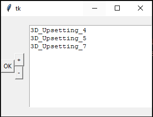

# Introduction

This program is a GUI used to extract and simply plot curves from the FORGE software.

# Execution

## Step 1: The MAIN.PY file

* **Important parameters:**
    * **The name of the sensors:** It is a dictionary indexed by the group number of the sensor (int) whose corresponding values are lists or sensor names (str).
    * **Legends:** The default legend for the simulations is the name of the Forge setup folder. You can replace it by another str.
    * **The plot type** for simulation curves.
    * **The plot type** for experimental curves.

* **Other parameters:**
    * The Damage Criterion.
    * The Phase Field Criterion (Default "Phase Field" recommended).
    * Unique curves are plots with double y-axis. You can configure other curves like the one provided (Stress & Phase Field vs. Strain) by adding an element to this dictionary.
    * The EXP_SURFACE is the cross section surface of the specimen. It is used to compute the experimental stress from the experimental strain and force, if you decide to add an experimantal file and to plot these variables.
    * Same case for the Experimantal strain variable.
    * COMPLETE_TITLE: If True, will add the sensor name and group in the title of the graph.

Run the `main.py` file. 

## Step 2: Choice of simulations

You can add or remove simulations (+ or - buttons). It is possible to select multiple simulations before adding them. Concerning which folder you should select, there are two cases:
* If you analyze a simulation **directly run on FORGE**, we recommend to select the folder of the setup (*e.g. test.tsv/3D_Upsetting*). But it is also possible to select the analysis folder (*e.g. test.tsv/Analysis/ResultDataBase/2_3D_Upsetting*).
* If you want to analyze a FORGE simulation **conducted by MOOPI**, please select the analysis folder (*e.g. C:\Users\matthieu.claudon\Documents\MOOPI\Computations_test_2024_01_29\Simulations\0\sim1*).

Then, according to the number of simulations you have selected, a result selector window will appear. The software hase two modes:
* **MODE 1:** If you have selected only one simulation, you will be able to compare curves at different sensors. So, multiple sensor selection will be possible.
* **MODE 2:** If you have selected two or more simulations, you will compare simulations between themselves. This is why you won't be able to select multiple sensors, but only one. The curves will be plotted at the selected sensor.

## Step 3: choice of the results

### MODE 1: One simulation (comparison between sensors)

* In the **Sensors** frame, you can select a sensor group and one or more sensors. It is not possible to select sensors from different groups.
* The frame **Curves (multiple plots)** allows you to plot the results in one *matplotlib* figure. In next versions, it should be possible to set them manually.
* The **unique curves** are curves with double y-axis. You can add such curves in the *Other Parameters* options in the `main.py` file.
* The **Others** frame allows you to plot a simulation curve with x-factor, x-offset, y-factor and y-offset, and even to add an experimental curve! The experimental file should be a *csv* file with a header of one line and ; as a separator.
### MODE 2: Multiple simulations (comparison between themselves)

The GUI is very similar but you can select only one sensor.

# Examples
## Mode 1 - Many Curves

## Mode 1 - Double y-Axis

## Mode 2 - Many curves

## Mode 2 - Experimental Curve

## Mode 2 - Without Experimental Curve

# Implementation

Functions are in the class `analyse` in the file `analyse.py`. They can be classified in 3 groups:
* GUI.
* Data extraction.
* Plot.

Almost all the functions used in MODE 2 contains *multiple* in their name.

In next versions:
* The functions of both modes should be mixed in one function to improve clarity of the code
* Units should be added.
* The possibility to add more curves than Force vs. Displacement, Stress vs. Strain, etc. should be added (like it is already possible for double y-axis curves).
